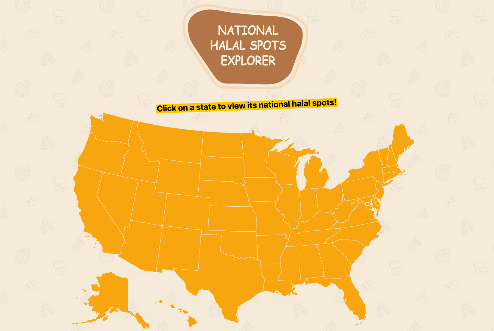
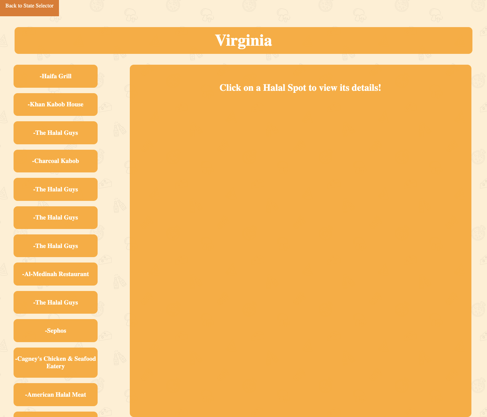
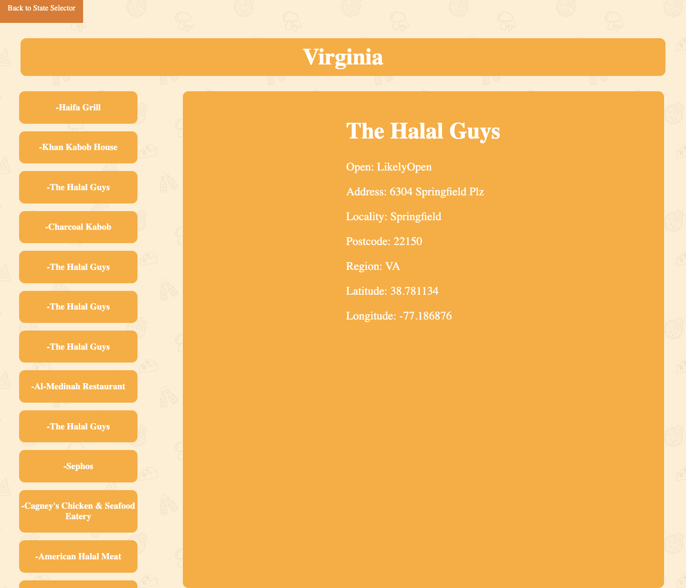
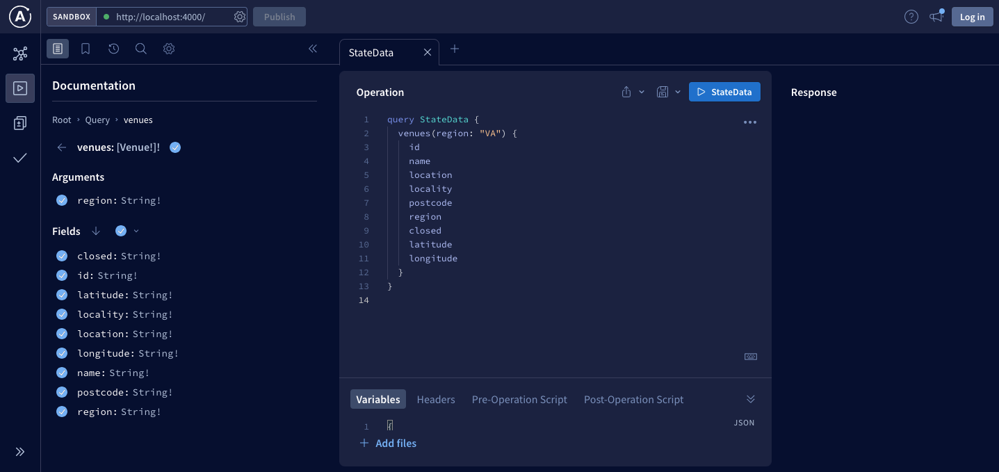
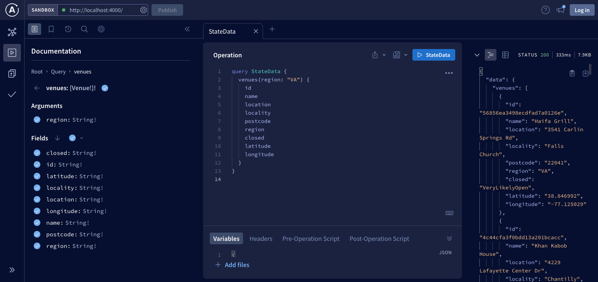
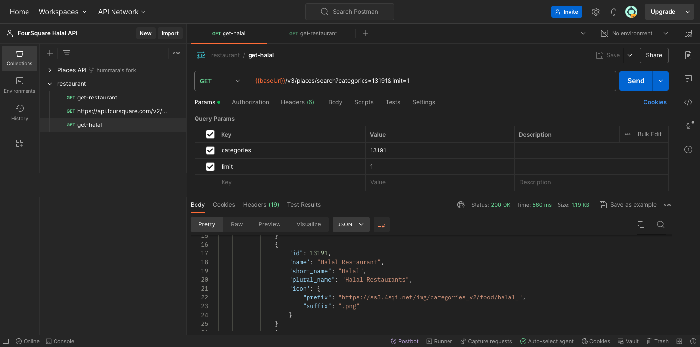

<h1 align="center">GraphQL - React - FourSquareAPI   National Map Explorer</h1>

## Description
Utilizing the FourSquare API, this app allows you to explore national halal spots by state. Upon opening the app, you will see a map of the United States. Click on a state to view its national spots. Then, click on a halal spot to view its location and other details. Details include a address, region, state, open/close info, longitude and latitude.

## Technologies Used

## Live Demo
Check out the live app: [National Halal Spot Explorer!!](https://national-halal-spots.netlify.app/)
 
And graphql playground: [GraphQL Playground!!](https://national-halal-spots.netlify.app/.netlify/functions/graphql)

## Screenshots

<table>
<tr>
<td></td>
<td></td>
</tr>
<tr>
<td></td>
<td></td>
</tr>
</table>

## Prerequisites

- [Install npm](https://docs.npmjs.com/downloading-and-installing-node-js-and-npm)
- [Install graphql](https://graphql.org/graphql-js/)

## Installation

1. Fork and close this repository to your local machine
2. Install NPM packages: `npm install`
3. Run `npm run start` to spin up the server
4. Run `npm run dev` to start up the application
5. Navigate to http://localhost:3000 in your browser to view Frontend
6. Navigate to http://localhost:4000 to view GraphQL playground.
